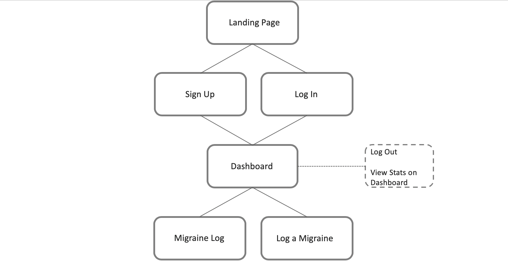
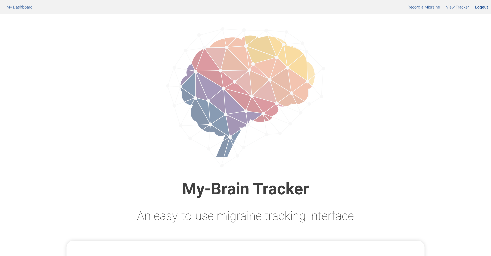
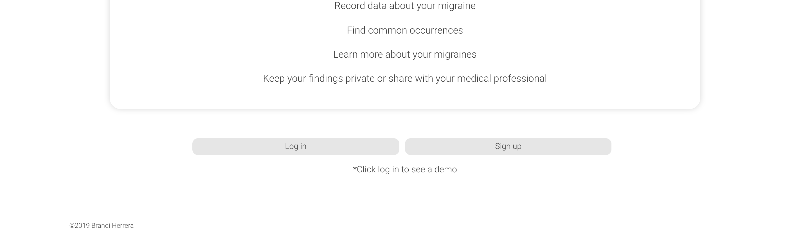
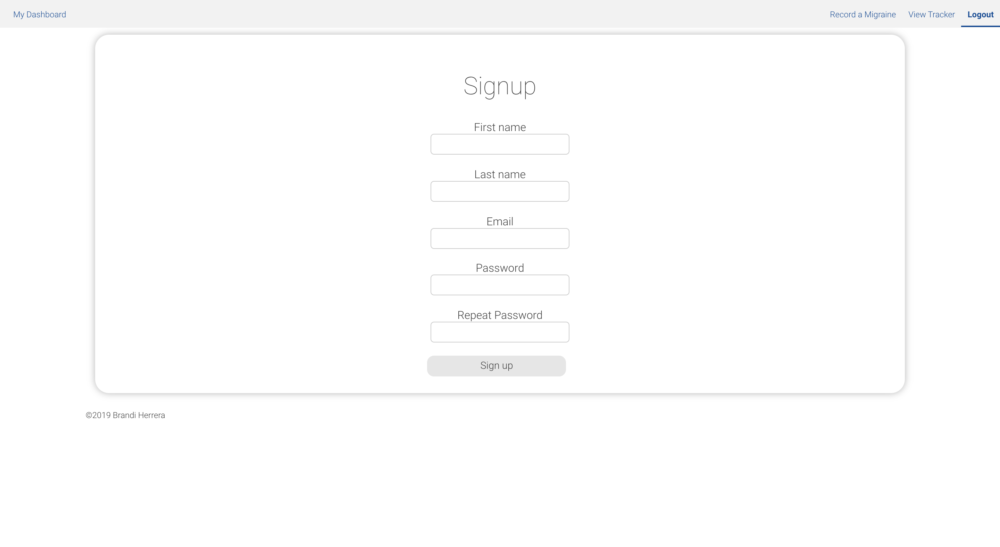
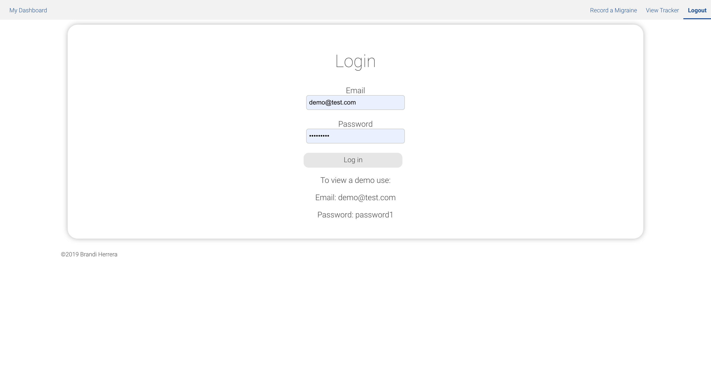
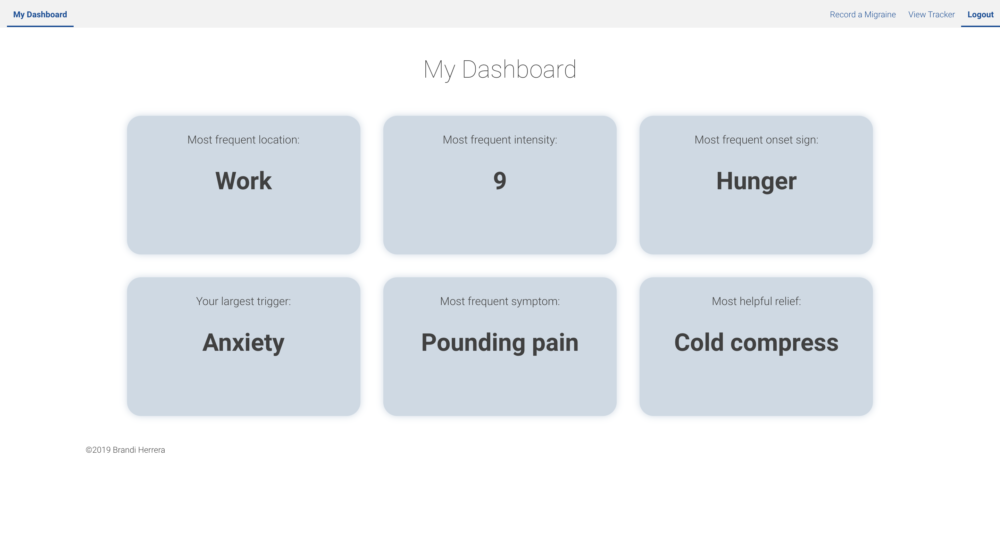
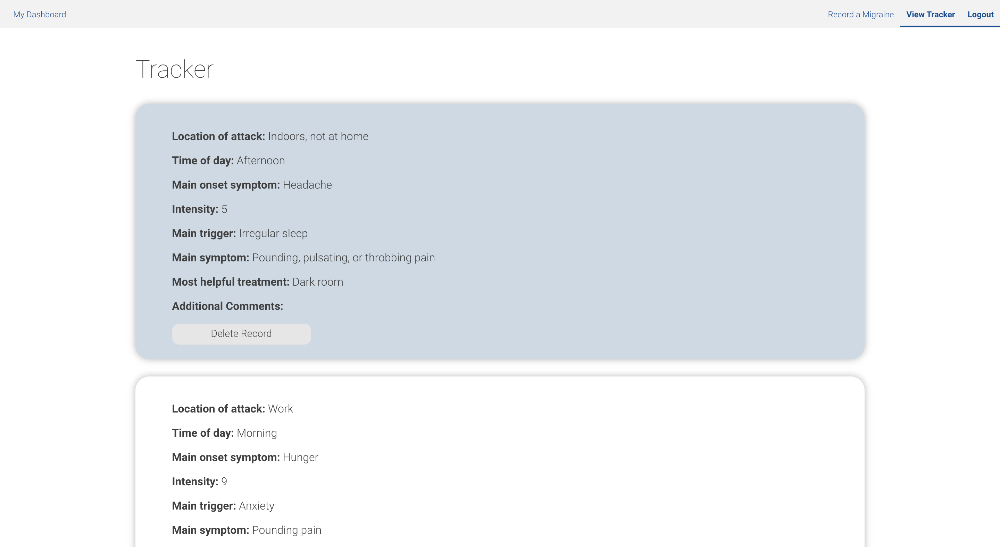
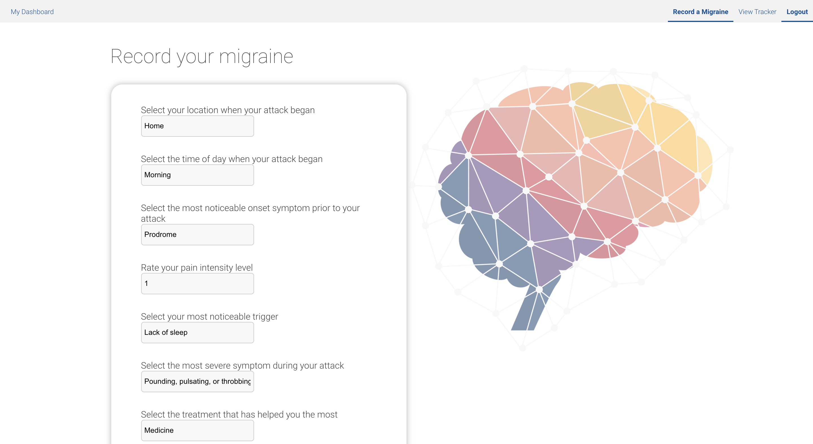

# My-Brain Tracker Server

This migraine app allows users to record their migraines along with details of the migraine. Users can view their records over time to find common symptoms and remedies, in addition to their highest occurring statistics. They can also share their findings with healthcare professionals so they may find a suitable treatment moving forward.

## Working Prototype
[My-Brain Tracker API Repo](https://github.com/brandiherrera/migraine-app-full-stack-capstone-server)

[My-Brain Tracker React Repo](https://github.com/brandiherrera/migraine-app-full-stack-capstone-react)

[Live My-Brain Tracker Application](https://migraine-app-full-stack-capstone-react.brandiherrera.now.sh/)

## Site Map: MVP



## User Stories

**Landing Page**

As a new user I want to understand the purpose of the app so I can decide if I want to sign up.

**Sign Up Page**

As a new user I want to sign up for the app so I can use it and save my migraine information on my account.

**Log In Page**

As a returning user I want to log in so I can have access to my saved migraine records.

**Dashboard**

As a returning user I want to record a new migraine record and view my saved records and data so I can discover my trends and most common occurring statistics as I wish.

**Migraine Tracker**

As a returning user I want to view my migraine log so I can find trends, view what has helped me previously, and share with a healthcare professional so I may find a suitable treatment moving forward.

**Record a Migraine**

As a returning user I want to record a migraine so I can track symptoms, triggers, remedies, and overall commonalities within my migraines.

**Log Out Page**

As a returning user I want to access a log out so I can log out at my convenience.


## Live Screenshots

### **Landing Page**

<span>
</span>

### **Sign Up Page**

#### POST `api/users`



### **Log In Page**

#### POST `api/auth/login`



### **Dashboard**

#### GET `api/users/:user_id/stats`



### **Migraine Tracker**

#### GET `api/users/:user_id/records` <br> DELETE `api/users/:user_id/records/:record_id`



### **Record a Migraine**

#### POST `api/users/:user_id/records`




## API Documentation

### Users Endpoints
*Private `/users/:user_id` endpoints require an `authorization` header with value of `bearer YOUR_AUTH_TOKEN_HERE` which is assigned upon signing up for an account.*

### POST `api/users`

Adds a new user to the user database which enables them to use their account to record and track the data they input. 

### POST `api/auth/login`

Allows a user in the database to "login" with their correct credentials. Returns the authToken and userId which allows them access to their private information on the secure `/users/:user_id` endpoints as below.

### GET `api/users/:user_id/stats`

Returns the highest statistics for the logged-in user so they can quickly view their most recurring data on their dashboard upon login.

**Example response**
```JSON
{
    "location": "Home",
    "count": "5",
    "time": "Morning",
    "onset": "Prodrome",
    "intensity": 1,
    "avg": "1.00000000000000000000",
    "trigger": "Lack of sleep",
    "symptom": "Pounding",
    "treatment": "Medicine"
}
```

### GET `api/users/:user_id/records`

Allows a logged-in user to access all of their records they have recorded by returning an array of the data.

**Example response**
```JSON
[
    {
        "id": 8,
        "user_id": 1,
        "date_created": "2019-12-17T22:00:19.407Z",
        "location": "Work",
        "time": "Morning",
        "onset": "Hunger",
        "intensity": 9,
        "trigger": "Anxiety",
        "symptom": "Pounding pain",
        "treatment": "Cold compress",
        "comment": "This attack began in my sleep."
    }
]
```

### DELETE `api/users/:user_id/records/:record_id`

Allows a logged-in user to delete a record using the `record_id` of the corresponding record.

A successful `DELETE` responds with `204 No Content`.

### POST `api/users/:user_id/records`

Allows a logged-in user to record a migraine with their relevant data.

**Example request body**
```JSON
{
    "location": "Work",
    "time": "Morning",
    "onset": "Hunger",
    "intensity": 6,
    "trigger": "Anxiety",
    "symptom": "Pounding",
    "treatment": "Cold compress",
    "comment": "This attack began in my sleep."
}
```
**Example response body**
```JSON
{
    "id": 76,
    "intensity": 6,
    "location": "Work",
    "onset": "Hunger",
    "symptom": "Pounding",
    "time": "Morning",
    "trigger": "Anxiety",
    "treatment": "Cold compress",
    "comment": "This attack began in my sleep."
}
```

## Technology Used

<b>Front End</b>
* HTML5
* CSS3
* JavaScript
* React
* Jest and Enzyme for testing
  
<b>Back End</b>
* Node.js
* Express.js
* PostgreSQL
* Mocha and Chai for testing

## Scripts

Install node modules `npm install`

Run the tests `npm test`

Start the application `npm start`

Start nodemon for the application `npm run dev`
